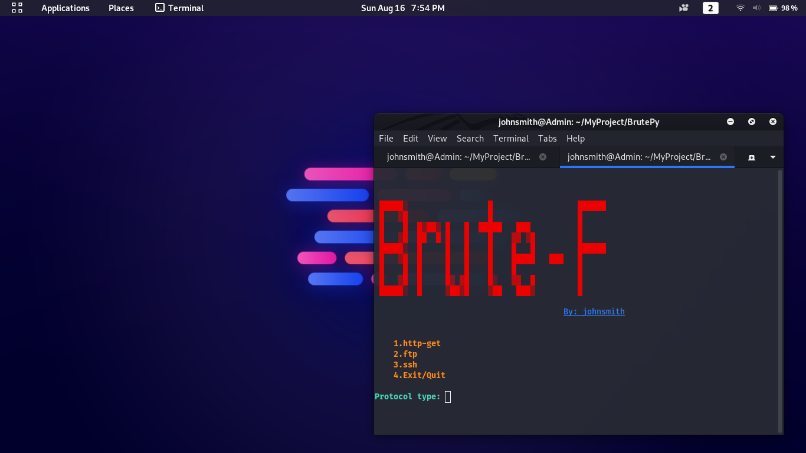
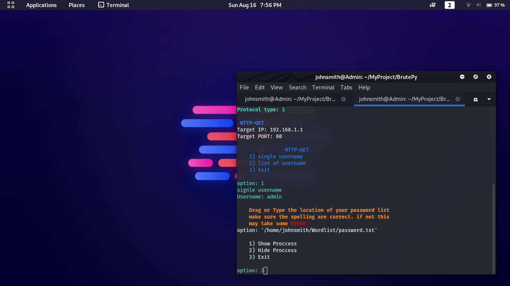
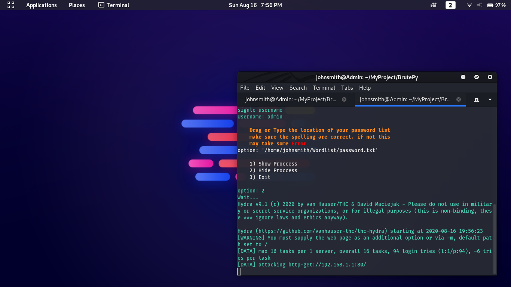
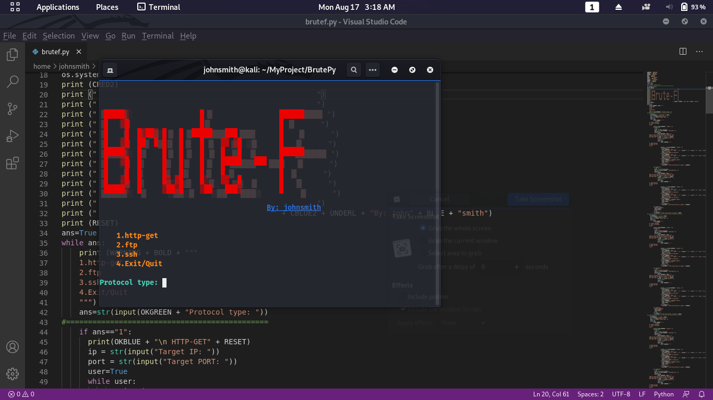
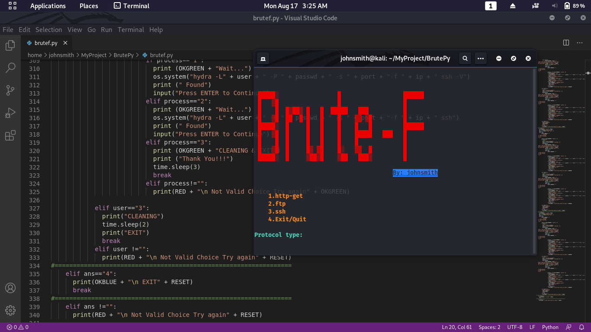

# Brute-F-Bash 
### by: Johnsmith

### Preview

## Brute-F
#### an SSH,HTTP,FTP Cracker
#### Automation tool running with hydra 
#### This is the Bash version avalable to be executable.
#### Bash version will be coming as soon as i post it.
#### this is for education purposes only. im not responsible for any illegal used of this tool. 

### Installation:

    git clone https://github.com/johnsmith80/Brute-F.git
    cd Brute-F-Bash
    chmod +x requirements.sh
    bash Brute-F or ./Brute-F

#### follow me on github: https://github.com/johnsmith80
#### Report any issue here: https://github.com/johnsmith80/Brute-F-Bash/issues
### Keep Hacking!
